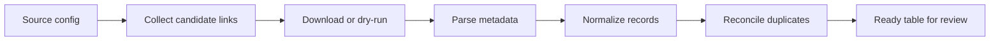

# Asset Report Automation Methods

Sanitized templates for reproducing a daily asset-report collection workflow.

This repository documents the method, folder layout, and reference code for an
automation pipeline that can:

- collect public report links from configurable sources
- download report files into date-based folders
- parse metadata from filenames and PDF text
- normalize records into a common schema
- reconcile duplicates before downstream upload or review
- run the same process as a scheduled daily job

The examples are intentionally generic. They do not include real source names,
issuer names, target URLs, login pages, account details, private endpoints, or
production data. Placeholder labels such as `SOURCE_A`, `ASSET_001`, and
`provider_slug` are used so the workflow can be studied without exposing the
original automation context.

## Overview

`asset-report-automation-methods` is a source-neutral automation template for
publicly documenting report collection, parsing, normalization, reconciliation,
and dry-run validation. It is designed to show the method without exposing real
targets, accounts, provider names, issuer names, or production data.



## Who Can Reuse This Repository?

This repository is intended for:

- developers building source-neutral document collection pipelines
- researchers who need a safe public example of daily report automation
- analysts separating collection, parsing, normalization, and reconciliation logic
- maintainers documenting private automation patterns without exposing targets
- students learning how to publish a sanitized automation method

It is a public template, not a production crawler. Real targets, credentials,
private URLs, and production records should remain in private configuration or
deployment repositories.

## Open Automation Value

The project is shared as a sanitized reproducibility template for automation
workflows. It demonstrates:

- how to define sources through placeholder configuration
- how to keep collection, parsing, and reconciliation as separate stages
- how to use synthetic data for public examples
- how to document safety boundaries before publishing automation code
- how to build a dry-run-first workflow for downstream review

## Repository Layout

```text
config/
  sources.example.yml       # placeholder source definitions
docs/
  sanitization_policy.md    # public-release rules
  workflow.md               # end-to-end pipeline notes
examples/
  sample_reports.csv        # synthetic normalized records
scripts/
  run_daily.ps1             # generic local scheduler entry point
src/asset_report_automation/
  cli.py                    # command-line interface
  fetch_reports.py          # generic collection skeleton
  models.py                 # shared dataclasses
  normalize.py              # normalization helpers
  parse_pdf.py              # PDF text extraction helpers
  reconcile.py              # duplicate and readiness checks
```

## Installation

```powershell
python -m venv .venv
.\.venv\Scripts\Activate.ps1
pip install -e .
```

## Usage

```powershell

python -m asset_report_automation.cli fetch --config config\sources.example.yml --out data\raw
python -m asset_report_automation.cli parse --input data\raw --out data\parsed\records.csv
python -m asset_report_automation.cli reconcile --input data\parsed\records.csv --out data\ready\ready.csv
```

The default configuration is a template. Replace placeholder selectors and
endpoints only in a private working copy.

## Example

Run the synthetic sample through the dry-run check:

```powershell
python -m asset_report_automation.cli dry-run --input examples\sample_reports.csv
```

Expected output:

```text
ready=2 rejected=0
```

## Related publication

No publication is attached. This repository is a sanitized methods template for
automation reproducibility and can be cited as software.

## Reproducibility Checklist

1. Start with `config/sources.example.yml`.
2. Keep source identifiers generic in public examples.
3. Run `python -m asset_report_automation.cli dry-run --input examples\sample_reports.csv`.
4. Review `docs/sanitization_policy.md` before committing changes.
5. Store real downloaded files and logs outside the public repository.

## Design Goals

- Keep collection, parsing, normalization, and upload preparation separate.
- Treat every source as a pluggable adapter.
- Save intermediate files for reproducibility.
- Keep public examples synthetic and source-neutral.
- Use dry-run checks before any downstream submission.

## What Is Not Included

- real source domains or page structures
- private credentials or session handling
- production scheduling metadata
- real report PDFs or crawled datasets
- real issuer, analyst, or provider names

## Citation

If this template helps your own automation documentation, cite the repository
using `CITATION.cff` or the GitHub citation button.

If you use this repository, please cite:

```text
Lee J. Asset Report Automation Methods. GitHub repository.
https://github.com/yzyzero0098/asset-report-automation-methods
```

## License

This repository is released under the MIT License. See `LICENSE`.

## Contributing

Issues and pull requests are welcome for generic template improvements,
validation checks, and documentation. See `CONTRIBUTING.md`.
